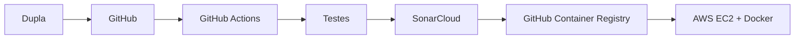

# Software Design Document (SDD)

## 1. Objetivo e escopo

O sistema é uma API REST simples para gerenciar tarefas. O objetivo acadêmico é demonstrar desenvolvimento orientado por especificação, testes automatizados, conteinerização, análise de segurança/qualidade e entrega contínua em AWS.

## 2. Requisitos funcionais

- RF01: criar tarefa com título obrigatório e descrição opcional;
- RF02: listar todas as tarefas;
- RF03: consultar uma tarefa pelo identificador;
- RF04: alterar título, descrição ou estado de conclusão;
- RF05: excluir uma tarefa;
- RF06: expor endpoint de saúde para monitoramento.

## 3. Requisitos não funcionais

- API em Python 3.12/FastAPI e formato JSON;
- persistência em SQLite em volume Docker;
- testes automáticos antes do deploy;
- análise do código pelo SonarCloud e quality gate bloqueante;
- imagem Docker executada com usuário sem privilégios;
- deploy automatizado em EC2 após aprovação da CI;
- documentação OpenAPI automática em `/docs`.

## 4. Arquitetura

Componentes internos: `main.py` contém rotas e regras; `schemas.py` valida os dados; `database.py` encapsula SQLite. O volume `task-api-data` preserva dados entre versões.

## 5. Modelo de dados

| Campo | Tipo | Regra |
|---|---|---|
| id | inteiro | chave primária autoincremental |
| title | texto | obrigatório, 1–120 caracteres |
| description | texto | opcional, até 500 caracteres |
| completed | booleano | padrão falso |
| created_at | data/hora | preenchido automaticamente |

## 6. Contrato da API

| Método | Rota | Resultado |
|---|---|---|
| GET | `/health` | saúde da aplicação |
| GET | `/tasks` | lista tarefas |
| POST | `/tasks` | cria tarefa |
| GET | `/tasks/{id}` | consulta tarefa |
| PATCH | `/tasks/{id}` | atualiza campos enviados |
| DELETE | `/tasks/{id}` | exclui tarefa |

## 7. Decisões e riscos

SQLite reduz a infraestrutura para a demonstração, mas não é indicado para alta concorrência. Uma única EC2 é um ponto único de falha. Para produção, usar ALB, Auto Scaling, RDS, TLS e observabilidade. O SSH e os tokens ficam somente nos GitHub Secrets. A porta SSH deve ser limitada ao IP da dupla.

## 8. Critérios de aceite

Todos os testes devem passar; o quality gate do SonarCloud deve estar aprovado; a imagem deve ser publicada; `/health` deve retornar HTTP 200 na EC2; o CRUD deve estar utilizável em `/docs`.
